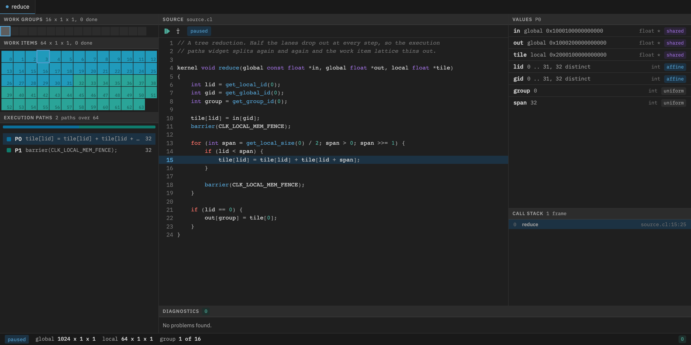

# vodd

An OpenCL 1.2 driver with a SPIR-V interpreter and a debugger you drive
from the browser. This project takes heavy inspiration from
[Oclgrind](https://github.com/jrprice/Oclgrind). The project aims to
redesign the traditional debugger interface for debugging GPGPU programs.

Kernels run on an interpreter instead of hardware, so vodd can watch every
memory access and report data races, barrier divergence and out of bounds
reads while your program runs unchanged.



## Getting started

- [Prerequisites](#prerequisites)
- [Build](#build)
- [Usage](#usage)
- [Debugger](#debugger)
- [Running tests](#running-tests)

## Prerequisites

vodd compiles OpenCL C to SPIR-V using clang, so a clang with a SPIR-V target
is required.

| Tool       | Minimum | Notes                                                 |
| ---------- | ------- | ----------------------------------------------------- |
| Rust       | 1.88    | edition 2024, install with rustup                     |
| clang      | 18      | 20 or newer can also build kernels without llvm-spirv |
| llvm-spirv | 20      | carries the line information the debugger needs       |
| spirv-link | any     | only needed to link multiple programs                 |

When llvm-spirv is present, kernels go through it and keep their line numbers
and variables. Without it, clang 20 or newer emits SPIR-V on its own, and the
kernels run and the checks still work, but nothing can name a line: the
debugger has no current line, breakpoints never fire and locals are empty.

On Debian and Ubuntu

```
sudo apt install clang-20 llvm-spirv-20 spirv-tools
```

On macOS

```
brew install llvm spirv-llvm-translator spirv-tools
```

If the tools are not on your path, point vodd at them with `VODD_CLANG`,
`VODD_LLVM_SPIRV` and `VODD_SPIRV_LINK`. When no usable toolchain is found,
building a program fails with a message naming the versions it wants.

## Build

```
cargo build --release
```

This produces `target/release/libvodd.so`, or `libvodd.dylib` on macOS.

## Usage

Run any OpenCL program against vodd by preloading the driver.

```
LD_PRELOAD=./target/release/libvodd.so clinfo
```

The program will see a single platform named vodd with a single device.
Nothing else about the program has to change.

You can also link a program against the driver directly, which is what the
test suites do.

```
cc my-program.c -Ltarget/release -lvodd -Wl,-rpath,$PWD/target/release
```

On macOS, link directly. There is no `LD_PRELOAD`, and `DYLD_INSERT_LIBRARIES`
does not divert calls away from the system OpenCL framework, so a program built
against it keeps talking to Apple. The Khronos headers are vendored, so after
`make submodules` this builds a program that sees the vodd platform.

```
cc my-program.c -DCL_TARGET_OPENCL_VERSION=120 -Itests/vendor/OpenCL-Headers -Ltarget/release -lvodd
DYLD_LIBRARY_PATH=target/release ./a.out
```

### Correctness checks

Checks are off by default. Turn them on with `VODD_CHECK`, which takes a comma
separated list.

| Value            | Reports                                           |
| ---------------- | ------------------------------------------------- |
| `all`            | everything below except `uniform-writes`          |
| `none`           | nothing, the default                              |
| `mem`            | out of bounds, misaligned and read only accesses  |
| `type`           | accesses that disagree with the declared type     |
| `divergence`     | work items reaching different barriers            |
| `races`          | unsynchronised accesses from different work items |
| `uniform-writes` | writes of the same value from every work item     |

```
VODD_CHECK=all LD_PRELOAD=./target/release/libvodd.so ./my-program
```

### Environment variables

| Variable          | Meaning                                                        |
| ----------------- | -------------------------------------------------------------- |
| `VODD_CHECK`      | which correctness checks to run, see above                     |
| `VODD_LOG`        | append diagnostics to this file instead of standard error      |
| `VODD_MAX_ERRORS` | stop reporting after this many diagnostics, default 1000       |
| `VODD_DEBUG`      | address to serve the debugger on, for example `127.0.0.1:8080` |
| `VODD_CLANG`      | path to clang                                                  |
| `VODD_LLVM_SPIRV` | path to llvm-spirv                                             |
| `VODD_SPIRV_LINK` | path to spirv-link                                             |

## Debugger

Set `VODD_DEBUG` to an address and vodd will serve a debugger there. The
program waits at the first line of the kernel until you continue it.

```
VODD_DEBUG=127.0.0.1:8080 LD_PRELOAD=./target/release/libvodd.so ./my-program
```

Open `http://127.0.0.1:8080` in a browser. You can step a work group a line at
a time, set breakpoints, pick which work item to watch, read locals and see
which work items took which branch.

## Running tests

Tests use a Makefile. Run `make` on its own to list the targets.

- Fetch the vendored Khronos repositories

    ```
    make submodules
    ```

- Run the Rust suites, the SPIR-V interpreter, the OpenCL conformance tests
  and the kernel checks

    ```
    make test-rust
    ```

- Run the browser tests for the debugger, this installs node packages and
  chromium the first time

    ```
    make test-browser
    ```

- Run everything

    ```
    make test
    ```

- Check formatting and lints

    ```
    make lint
    ```

- Format the Rust sources and the templates

    ```
    make fmt
    ```
